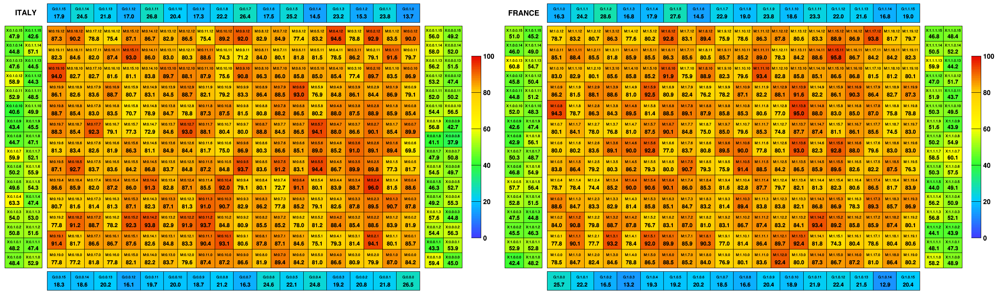
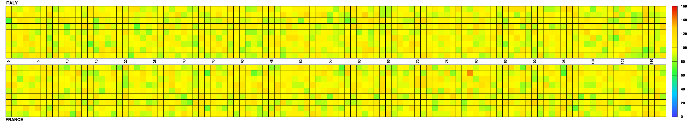

# sndisplay : supernemo detector display

## sndisplay::calorimeter



run sndisplay::calorimeter demo script :
```	  
root

.L sndisplay.cc

// fill with random value and draw with palette
sndisplay_calorimeter_test_values();

// set manually text and color
sndisplay_calorimeter_test_status();

// convertion map OM_ID <=> OM_NUM
sndisplay_calorimeter_test_omnum();
```


## sndisplay::tracker



run sndisplay::tracker demo script :
```	  
root

.L sndisplay.cc

// fill with random value and draw with palette
sndisplay_tracker_test();
```


## sndisplay::demonstrator
